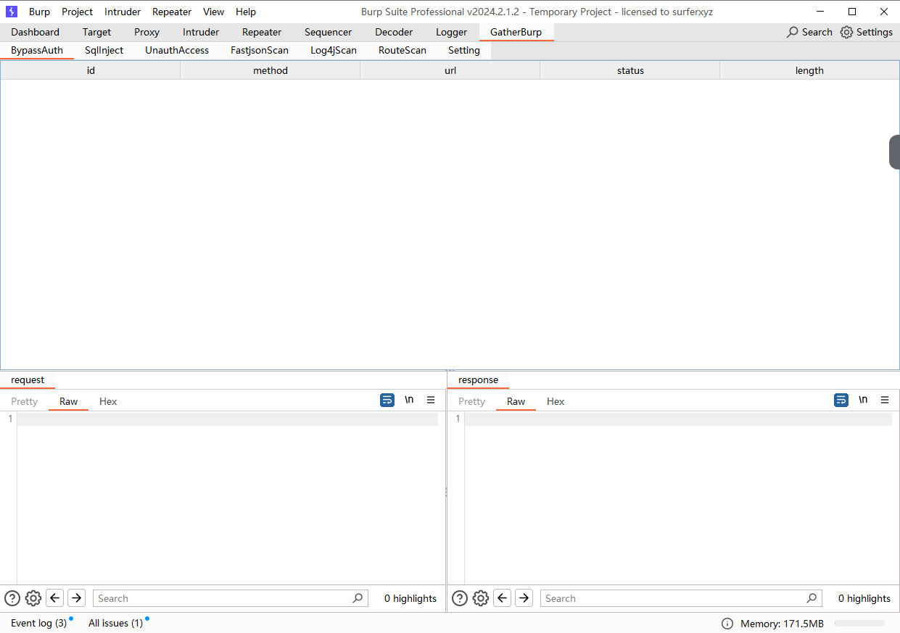

# GatherBurp

<div align="center">


[](LICENSE)
[](https://github.com/kN6jq/gatherBurp/stargazers)
[](https://github.com/kN6jq/gatherBurp/issues)
[](https://github.com/kN6jq/gatherBurp/releases)

**一款强大的 BurpSuite 安全测试扩展，集成多种漏洞检测与渗透测试功能**

[功能特点](#-功能特点) •
[快速开始](#-快速开始) •
[详细文档](#-详细文档) •
[贡献指南](#-贡献指南) •
[交流讨论](#-交流讨论)

</div>

## 📋 功能特点

GatherBurp 集成了多种安全测试功能，可大幅提升渗透测试和漏洞挖掘效率。

### 🔍 漏洞检测

- **Fastjson 漏洞扫描**
  - 支持 DNS 回连检测
  - 支持 JNDI 利用链检测
  - 支持回显检测（Tomcat、Spring 等环境）
  - 支持版本识别

- **SQL 注入检测**
  - 支持 GET、POST 参数检测
  - 支持 Cookie 参数检测
  - 支持多层级 JSON 参数检测
  - 支持报错注入、时间盲注、布尔盲注
  - 支持自定义 payload 和检测规则

- **Log4j 漏洞检测**
  - 支持 DNS 和 IP 回连检测
  - 支持参数和 Header 检测
  - 自定义 payload 列表

- **URL 重定向漏洞检测**
  - 自动检测常见重定向参数
  - 支持自定义 payload 和参数列表
  - 结果可按 ID 数值排序

### 🛡️ 权限测试

- **越权访问检测**
  - 支持原始请求、低权限请求和无权限请求对比
  - 自动分析响应长度差异
  - 结果可按 ID 数值排序

- **认证绕过测试**
  - URI 特殊字符绕过
  - Header 字段绕过
  - Accept 头绕过

### 🌐 信息收集

- **多层级路由扫描**
  - 支持复杂条件表达式过滤
  - 自定义字典和规则
  - 智能识别有效路径

### 🔧 辅助工具

- **Nuclei 模板生成**
  - 一键生成 Nuclei 扫描模板
  - 支持多种漏洞类型

- **代理池功能**
  - 支持 SOCKS 代理
  - 多代理自动切换

- **复杂数据提交**
  - 支持 Base64 编码数据自动解码
  - 解决序列化数据编码问题

- **工具快速调用**
  - 支持自定义工具集成
  - 支持占位符：{url}、{host}、{request}

## 🚀 快速开始

### 安装要求

- JDK 1.8+
- BurpSuite Professional 2021.x+
- Maven 3.6+ (仅编译时需要)

### 编译安装

```bash
# 克隆仓库
git clone https://github.com/kN6jq/gatherBurp.git

# 进入项目目录
cd gatherBurp

# 编译打包
mvn clean package
```

编译后的 JAR 文件位于 `target/` 目录下。

### 在 BurpSuite 中加载

1. 打开 BurpSuite Professional
2. 进入 `Extender` -> `Extensions` 标签
3. 点击 `Add` 按钮
4. 选择 `Java` 类型，并选择编译好的 JAR 文件
5. 点击 `Next` 完成加载

### 基本使用

所有功能可通过以下方式访问：

1. **右键菜单**：在 Proxy、Repeater 等模块中右键点击请求
2. **扩展标签页**：在 BurpSuite 顶部标签栏中的 `GatherBurp` 标签

## 📚 详细文档

### Fastjson 扫描


**使用步骤：**

1. 在 `配置` 标签页设置 DNS 和 IP
2. 右键选择 `FastJson` -> 选择检测类型：
   - DNS 检测：适用于外网环境
   - JNDI 检测：支持 DNS/IP 回连
   - 回显检测：适用于内网环境
   - 版本检测：识别 Fastjson 版本

**高级配置：**

- DNS 扫描：配置类型为 dns，使用 FUZZ 占位符
- 回显检测支持多种环境：Tomcat、Spring 等

### SQL 注入检测

**功能特点：**

- 支持多种注入类型检测
- 支持参数、Cookie、Header、JSON 数据
- 支持自定义 payload 和错误关键字
- 支持白名单域名过滤
- 结果可按 ID 数值排序

**使用方法：**

1. 右键选择 `SQL Inject` 
2. 在标签页中配置检测参数
3. 查看检测结果和详细请求响应

### Log4j 漏洞检测

**功能特点：**

- 支持 DNS 和 IP 回连检测
- 支持参数和 Header 检测
- 自定义 payload 列表
- 结果可按 ID 数值排序

**使用方法：**

1. 右键选择 `Log4j Scan`
2. 在标签页中配置检测参数
3. 查看检测结果和详细请求响应

### 权限检测



**功能特点：**

- 支持原始请求、低权限请求和无权限请求对比
- 自动分析响应长度差异
- 结果可按 ID 数值排序

**使用方法：**

1. 右键选择 `Perm Check`
2. 在标签页中配置低权限和无权限认证信息
3. 查看检测结果和详细请求响应对比

### URL 重定向检测

**功能特点：**

- 自动检测常见重定向参数
- 支持自定义 payload 和参数列表
- 结果可按 ID 数值排序

**使用方法：**

1. 右键选择 `UrlRedirect`
2. 在标签页中配置检测参数
3. 查看检测结果和详细请求响应

### 多层级路由扫描

**表达式语法：**

```
code=200
body="hello"
title="druid"
headers="Content-Type: application/json"

# 复杂条件
code=200 && body="hello"
code!=200 && (body="hello" || title="druid")
```

**使用方法：**

1. 在 `Route` 标签页配置扫描参数
2. 设置字典和过滤条件
3. 开始扫描并查看结果

### 工具快速调用

**配置方法：**

1. 在 `配置` 标签页添加工具名称和命令
2. 支持以下占位符：
   - `{url}`: 当前请求的完整 URL
   - `{host}`: 当前请求的主机名
   - `{request}`: 当前请求的临时文件路径

**使用方法：**

右键菜单中选择配置好的工具名称即可快速调用

## 🤝 贡献指南

我们非常欢迎各种形式的贡献：

- 🐛 **报告 Bug**：提交详细的 Bug 报告，包括复现步骤
- 💡 **功能建议**：提出新功能或改进建议
- 📝 **文档改进**：完善或更正文档内容
- 🔧 **代码贡献**：提交 Pull Request 修复问题或添加功能

**贡献流程：**

1. Fork 本仓库
2. 创建功能分支 (`git checkout -b feature/amazing-feature`)
3. 提交更改 (`git commit -m 'Add some amazing feature'`)
4. 推送到分支 (`git push origin feature/amazing-feature`)
5. 提交 Pull Request

## 👥 交流讨论

加入微信讨论群：

请移步 Issues 查看群聊二维码

## 📋 未来计划

- [ ] 更多漏洞检测模块
- [ ] 性能优化和代码重构
- [ ] 完善文档和使用示例
- [ ] 支持更多自定义配置选项
- [ ] 国际化支持

## ⚠️ 免责声明

本工具仅用于授权的安全测试和教育目的，请勿用于非法用途。使用本工具造成的任何后果由使用者自行承担。

## 📄 许可证

[MIT License](LICENSE)

---

<div align="center">

如果觉得这个项目对您有帮助，请给个 Star ⭐️ 支持一下！

</div>
